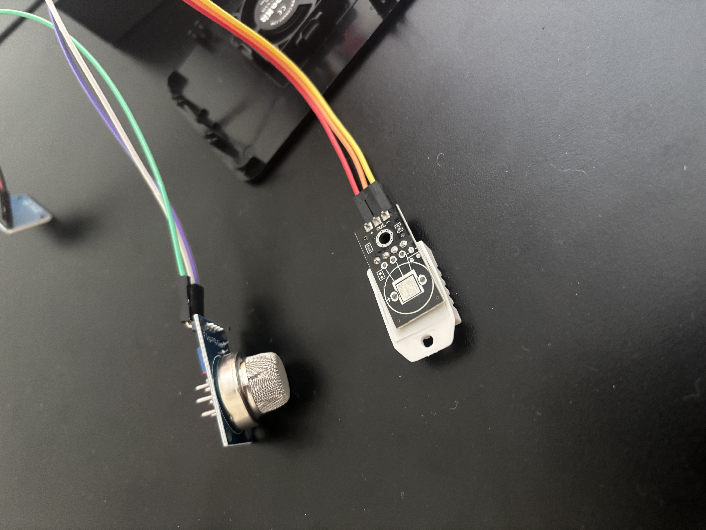
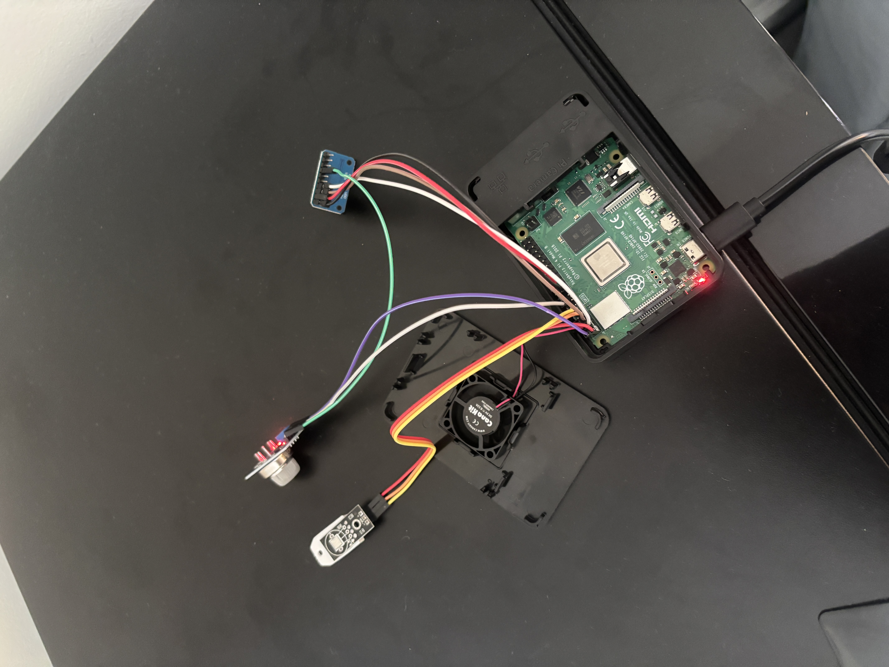
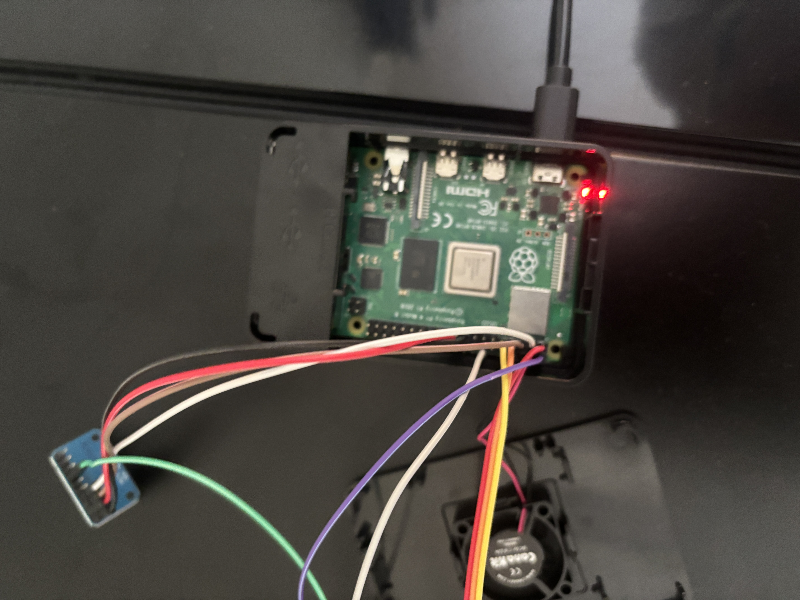
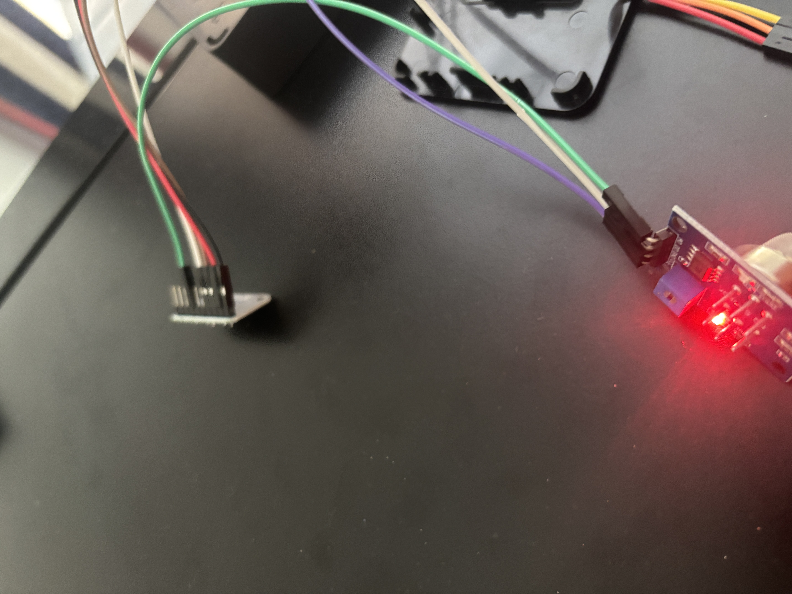

# Environment Monitor

A Raspberry Pi 4 environmental monitoring system that continuously reads temperature, humidity, and air quality data from sensors and displays it on a live web dashboard.

## Hardware
- Raspberry Pi 4 Model B (4GB)
- DHT22 Temperature & Humidity Sensor
- MQ-135 Air Quality Sensor
- ADS1115 16-bit ADC (for analog MQ-135 signal)

## Software Stack
- Python 3 with Adafruit CircuitPython libraries
- SQLite for local data storage
- Flask REST API backend
- Chart.js frontend dashboard

## Features
- Live temperature, humidity, and air quality readings
- Historical data graphs with automatic 30-second refresh
- Data logged every 60 seconds to SQLite database
- Accessible from any device on the local network
- Runs automatically on boot via systemd services
- Parameterized SQL queries to prevent SQL injection

## Wiring
- DHT22: VCC → Pin 1, DATA → Pin 7 (GPIO 4), GND → Pin 9
- ADS1115: VDD → Pin 17, GND → Pin 20, SCL → Pin 5, SDA → Pin 3
- MQ-135: VCC → Pin 2 (5V), GND → Pin 14, A0 → ADS1115 A0

## Setup
1. Flash Raspberry Pi OS (64-bit) to SD card
2. Enable I2C via raspi-config
3. Clone this repo and create a virtual environment
4. Install dependencies: `pip install flask adafruit-circuitpython-dht adafruit-circuitpython-ads1x15`
5. Enable systemd services for automatic startup

## Architecture
```
Sensors → GPIO/I2C → Python → SQLite → Flask API → Browser Dashboard
```

## Hardware Photos






## Build Log

### 1. Initial Setup
Flashed Raspberry Pi OS to a 32GB SD card using Raspberry Pi Imager on macOS, configuring hostname, SSH, WiFi, and timezone during the flash process. Booted the Pi headless and connected via SSH from MacBook. Updated the OS and enabled I2C via `raspi-config`.

### 2. Sensor Wiring
Wired the DHT22 temperature and humidity sensor to the GPIO pins and verified readings with a test script. The ADS1115 ADC module arrived with unsoldered header pins and required soldering before use — initial cold joints on the SCL and SDA pins prevented I2C detection entirely. Debugged using `i2cdetect -y 1`, reflowed the joints, and confirmed the ADS1115 at address `0x48`. Wired the MQ-135 air quality sensor through the ADS1115 and verified analog voltage readings. The MQ-135 required a 24+ hour burn-in period so that the readings could stabilize.

### 3. Software Stack
Built a SQLite database schema to store timestamped sensor readings. Wrote a Python data collection script saving readings every 60 seconds using parameterized queries. Built a Flask REST API serving the data as JSON, then built an HTML/JavaScript dashboard using Chart.js for live updating graphs with 30 second auto refresh. Fixed a timezone display issue by converting SQLite UTC timestamps to local time in JavaScript.

### 4. Deployment
Configured two systemd services for automatic startup on boot, one for the sensor collection script and one for the Flask web server, both set to restart automatically on failure. Verified by rebooting the Pi and confirming the dashboard loaded at `http://envmonitor.local:5000` with no manual intervention.

## Challenges
- Cold solder joints on ADS1115 caused I2C detection failure — resolved by reflowing SCL and SDA pins
- MQ-135 required 24+ hour burn-in period, where the sensor voltage dropped from 2.29V to ~0.41V over the 'burn in' period
- DHT22 occasional checksum errors handled gracefully with try/except in the reading loop
- Timezone mismatch between SQLite UTC timestamps and local display resolved in JavaScript
- - MQ-135 PPM conversion proved unreliable without proper calibration — the standard datasheet formula requires a known baseline resistance (R0) specific to each individual sensor. Attempted to calculate R0 from the stabilized voltage reading after burn-in, but the cheap sensor module's actual response curve doesn't precisely match the datasheet, resulting in inaccurate PPM values. Air quality is displayed as raw voltage (V) which accurately reflects relative changes in air quality even without a calibrated PPM conversion.
